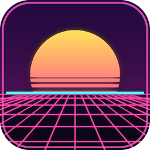

# Clawd Rdio

An 80s synth groovebox that runs in your browser: a drum machine, analog and FM synths, a pattern arranger, a mixer with gated reverb and a ping-pong delay, a full-screen visualizer with a song clock, swappable themes, and 48 songs, six of them with sung vocals.

**Play it:** https://z3r0-zeus.github.io/clawd-rdio/

Best on a computer in Chrome, Edge or Brave, with the sound on. Press the spacebar to play, open **Songs** to pick a track, and press **Visualizer** for the full-screen player (the **SONGS** button there builds playlists). **Themes** changes the look of the whole app.

## About

- Everything is made inside the app. The songs were written and arranged by Claude (Opus 5.5 High and Sonnet 5.5 Extra); the synth classics are arrangements of public-domain music.
- The sung vocals are AI voices made with ElevenLabs Music.
- It is an independent hobby project and is not affiliated with or endorsed by Anthropic or by Nous Research. The Anthropic, Claude.ai and Nous themes are only inspired by those sites' colors and typography, with free fonts standing in for theirs.
- This repository holds just the playable page. The source lives in a separate private repository.
